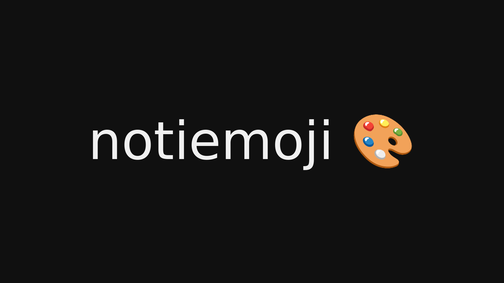
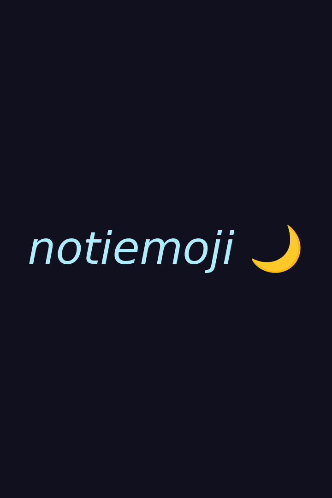
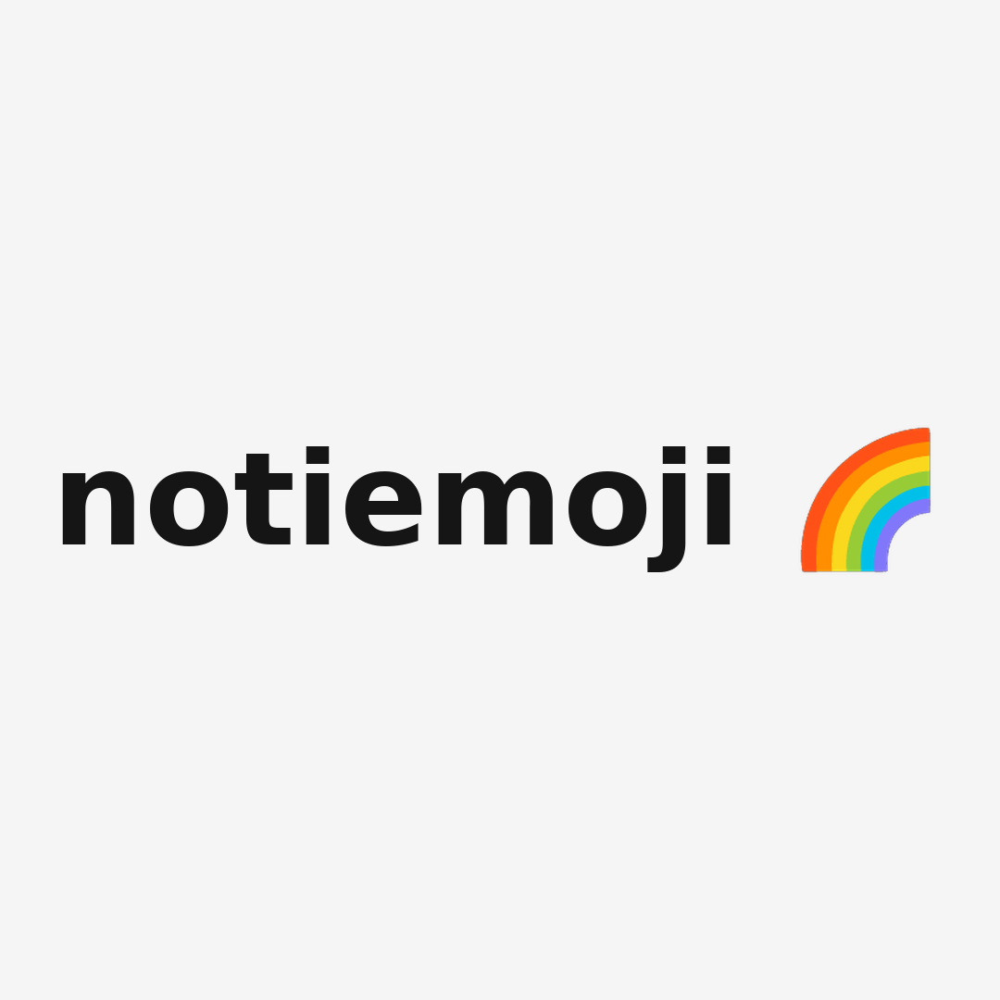

# notiemoji

Genera wallpapers PNG con un fondo de color plano y texto o emojis centrados.

**Demo:** [https://notiemoji.onrender.com](https://notiemoji.onrender.com)



## Ejemplos

El mismo script genera distintos formatos y estilos:

| Vertical — `720x1080` | Cuadrado — `1080x1080` |
|---|---|
|  |  |

## Requisitos

- Python 3.11 o superior
- [uv](https://docs.astral.sh/uv/), para gestionar el entorno virtual y las
  dependencias
- Pillow 10.1 o superior
- FastAPI, para la API HTTP, y `uvicorn`, el servidor que arranca `api.py`
- En desarrollo: `httpx` (lo necesita `fastapi.testclient.TestClient`
  para los tests de la API)
- Fuentes del sistema: DejaVu Sans (texto) y Noto Color Emoji (emojis). Para
  cursivas se usa Liberation Sans si DejaVu no trae la variante Oblique.

En Debian/Ubuntu:

```bash
sudo apt install fonts-dejavu-core fonts-noto-color-emoji
```

## Instalación

Las dependencias están declaradas en `pyproject.toml` y se sincronizan con
`uv`:

```bash
uv sync
```

Eso crea el entorno virtual `.venv`, instala las dependencias de producción
(`Pillow`, `fastapi` y `uvicorn`) más las de desarrollo (`httpx`, que
necesita `fastapi.testclient.TestClient` para transporte HTTP) y deja la
resolución fijada en `uv.lock`. El grupo de desarrollo se instala por
defecto.

## Uso

El modo interactivo se inicia sin argumentos:

```bash
uv run python notiemoji.py
```

También se puede usar desde la línea de comandos:

```bash
uv run python notiemoji.py -r 1920x1080 -p grafito -f 96 -t "notiemoji 🎨"
uv run python notiemoji.py -r 720x1080 -p noche -f 96 -i -t "notiemoji 🌙"
uv run python notiemoji.py -r 1080x1080 -p papel -f 140 -b -t "notiemoji 🌈"
```

La salida por defecto es `wallpaper.png`. Para elegir otro archivo:

```bash
uv run python notiemoji.py -r 1920x1080 -p oceano -t "hola 🚀" -o images/fondo.png
```

## API

`api.py` expone una API HTTP con FastAPI que reutiliza la lógica de
`notiemoji.py`. Genera el PNG en memoria y lo devuelve sin escribir archivos
en disco.

Arranque en desarrollo:

```bash
uv run uvicorn api:app --reload
```

Endpoints:

| Endpoint | Descripción |
|---|---|
| `POST /wallpaper` | Genera el wallpaper y lo devuelve como `image/png`. |
| `GET /wallpaper` | Igual que el `POST`, pero con los campos por query string. |
| `GET /paletas` | Lista las 10 paletas (`nombre`, `color`, `texto`). |
| `GET /health` | Estado (`ok` o `degradado`), versión y fuentes. |
| `GET /` | Sirve el probador interactivo en español (`index.html`). |

Campos del body JSON de `POST /wallpaper`. `GET /wallpaper` acepta los
mismos campos como query string, con los mismos tipos, defectos y
validaciones, así que esta tabla sirve para los dos:

| Campo | Tipo | Defecto | Validación |
|---|---|---|---|
| `width` | entero | obligatorio | mayor a 0, máx. 4000 |
| `height` | entero | obligatorio | mayor a 0, máx. 4000 |
| `text` | string | `""` | texto y/o emojis |
| `palette` | string o null | `null` | un nombre de la tabla de Paletas |
| `color` | string o null | `null` | hex (`#0d1117`) o nombre CSS |
| `text_color` | string o null | `null` | hex o nombre CSS |
| `font_size` | entero | `96` | mayor a 0, máx. 2000 |
| `bold` | booleano | `false` | |
| `italic` | booleano | `false` | |

La precedencia de colores es la misma que en la CLI. Solo se acepta un
nombre de paleta tal cual (`noche`); el sinónimo `ninguna` de la CLI no
existe acá, simplemente no envíes `palette`.

Cada lado está limitado a 4000 px. Una imagen de 4000x4000 en RGB ocupa
unos 48 MB (pico medido con emoji: ~90 MB), y el plan gratis de Render
tiene 512 MB: el límite deja holgado el pico de memoria.

Códigos de respuesta de `/wallpaper`:

| Código | Cuándo |
|---|---|
| `200` | Devuelve el PNG generado. |
| `422` | Validación; los mensajes van en español. |
| `429` | Demasiadas generaciones simultáneas (máx. 3) con `Retry-After: 1`. |
| `503` | Falta la fuente `NotoColorEmoji.ttf`; el detalle sugiere instalarla. |
| `500` | Fallo inesperado, sin stack trace. |

El `429` rechaza de inmediato, sin encolar: encolar acumularía imágenes
en memoria, justo lo que el límite busca evitar.

`GET /paletas` y `GET /health` responden `200` siempre. En `/health` el
estado real va en el body: `estado` es `ok` o `degradado` según haya
todas las fuentes, no el código HTTP.

Ejemplo de petición:

```bash
curl -X POST http://127.0.0.1:8000/wallpaper \
  -H "Content-Type: application/json" \
  -d '{"width": 1920, "height": 1080, "palette": "noche", "text": "hola 🚀"}' \
  -o wallpaper.png
```

La misma petición por query string. El emoji va percent-encoded en
UTF-8 (`%f0%9f%9a%80` es 🚀) y la URL va partida por legibilidad (la
barra invertida la vuelve a unir):

```bash
curl -o wallpaper.png \
  "http://127.0.0.1:8000/wallpaper?width=1920&height=1080\
&palette=noche&text=hola%20%f0%9f%9a%80&bold=true"
```

Ante los mismos valores, `GET /wallpaper` devuelve el mismo PNG que el
`POST`, byte por byte.

Abrí `http://127.0.0.1:8000/` para el probador interactivo: pide las
paletas a `GET /paletas` y arma el select en el navegador; sin API
detrás, el select queda solo con «ninguna». Al enviar el formulario hace
el `fetch` a `POST /wallpaper` y muestra o descarga la imagen. La
documentación interactiva está en `http://127.0.0.1:8000/docs` (Swagger),
con el esquema en `/openapi.json`; `GET /` queda oculto de `/docs` y
`GET /wallpaper` aparece junto al `POST` (mismo path, dos métodos).

Al cambiar la paleta en el select, los campos «Color de fondo» y «Color
de texto» se rellenan con la pareja de esa paleta, y sus selectores de
color nativos también. Con «ninguna» los campos quedan vacíos: no se
envían y la API aplica `#000000` / `#ffffff`.

Cada campo de color tiene un selector de color nativo (`input
type="color"`) junto al campo de texto. El selector escribe hex
`#rrggbb`; el campo de texto además sigue aceptando nombres CSS
(`navy`, `hotpink`, ...), que el selector no puede representar. Los dos
están sincronizados en ambos sentidos.

## Opciones

| Opción | Alias | Descripción |
|---|---|---|
| `--resolution` | `-r` | Tamaño de la imagen en formato `anchoxalto`; obligatorio en modo CLI. |
| `--palette` | `-p` | Paleta curada que define fondo y texto. |
| `--color` | `-c` | Color de fondo manual en hexadecimal o nombre CSS. |
| `--text-color` | `-C` | Color del texto manual en hexadecimal o nombre CSS. |
| `--font-size` | `-f` | Tamaño de la fuente en píxeles; por defecto `96`. Si el texto no cabe, se reduce solo hasta que quepa. |
| `--bold` | `-b` | Dibuja el texto normal en negrita. |
| `--italic` | `-i` | Dibuja el texto normal en cursiva. |
| `--text` | `-t` | Texto y/o emojis para centrar. |
| `--output` | `-o` | Ruta del PNG de salida; por defecto `wallpaper.png`. |

Si se combinan `-p` con `-c` o `-C`, los colores explícitos tienen prioridad.

## Paletas

| Paleta | Fondo | Texto |
|---|---|---|
| `papel` | `#f5f5f5` | `#151515` |
| `grafito` | `#101010` | `#f0f0f0` |
| `oceano` | `#003355` | `#aaeeff` |
| `noche` | `#10101f` | `#aaeeff` |
| `menta` | `#99ffaa` | `#115533` |
| `mate` | `#101f10` | `#6abe30` |
| `amor` | `#901010` | `#ffdddd` |
| `marte` | `#1f1010` | `#ff7777` |
| `uva` | `#1D001D` | `#ffaaff` |
| `nanana` | `#101010` | `#ff50ff` |

Las paletas están diseñadas para mantener un contraste alto entre el fondo y el
texto. Los nombres de colores CSS también se pueden usar con `-c` y `-C`.

## Despliegue

- **Render**: la configuración está en [`render.yaml`](render.yaml). El
  build command es `pip install uv && uv sync --no-dev` y el start command
  es `uv run uvicorn api:app --host 0.0.0.0 --port $PORT`. El probador
  interactivo queda servido en `GET /`.

## Pruebas

La suite utiliza `unittest` de la biblioteca estándar: 48 tests en dos
archivos, `tests/test_notiemoji.py` (16) y `tests/test_api.py` (32).

```bash
uv run python -m unittest discover -s tests -v
```

## Licencia

Distribuido bajo la licencia [MIT](LICENSE). Las fuentes no se distribuyen
con el proyecto: se usan las instaladas en el sistema.
